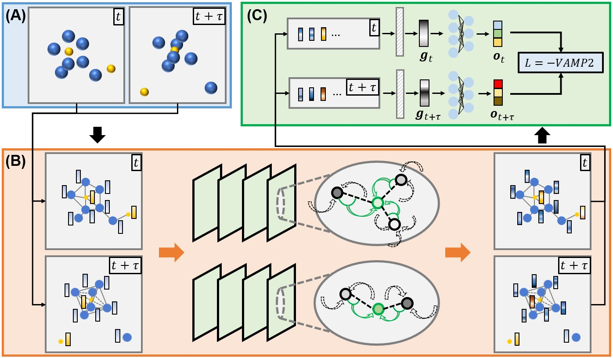

GraphVAMPnets for Uncovering Slow Collective Variables of Self-Assembly Dynamics
================================================================================


Installation
------------
The source code can be installed with a local clone:

```bash
git clone https://github.com/xuhuihuang/graphvampnets.git
```

(note that the dependencies should be installed first by two steps)

```bash
pip install -r ./requirements1.txt
pip install -r ./requirements2.txt
```

```bash
python ./setup.py install
```

Reference
---------
Our codebase builds heavily on
- [https://github.com/msmbuilder/msmbuilder](https://github.com/msmbuilder/msmbuilder)
- [https://github.com/deeptime-ml/deeptime](https://github.com/deeptime-ml/deeptime)
- [https://github.com/ghorbanimahdi73/GraphVampNet](https://github.com/ghorbanimahdi73/GraphVampNet)

Thanks for open-sourcing!
